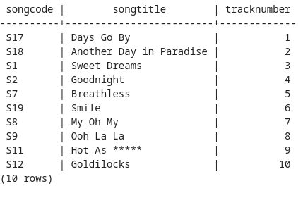
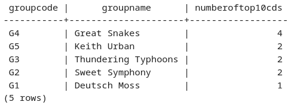
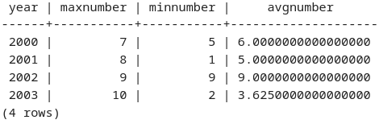
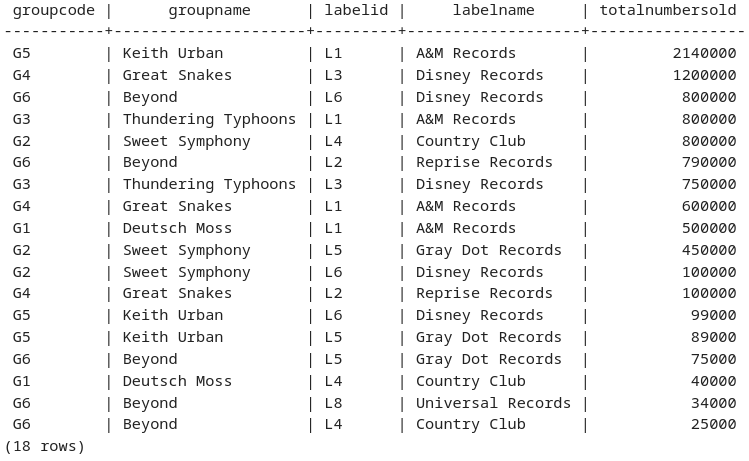
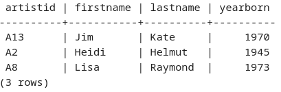
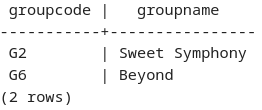

# COMP 353: Homework 1

## 2022-10-12

## Collaborators
 
* Anshul Narang:
    * Worked on all 6 queries
    * Organized a meeting to work on unsolved queries/review solved queries 
* Nick Shannon:
    * Worked on queries 3 and 6; reviewed remaining 4
    * Gathered outputs and created report

## Queries

1. Query 1:

```sql
/* Question 1 */
select co.songcode,s.songTitle, tracknumber from composedof co ,song s 
where s.songcode = co.songcode and cdcode = (
    select cdcode from topcds where year = 2003 and rating = 1
    )
order by tracknumber
```


2. Query 2:

```sql
/* Question 2 */
select mg.groupcode,groupname,count(*) as numberOfTop10CDs
from musicalgroup mg, cd c, topcds tc
where mg.groupcode = c.groupcode and c.cdcode = tc.cdcode and tc.rating <= 10
group by mg.groupcode, mg.groupname
order by numberOfTop10CDs desc
```


3. Query 3:

```sql
/* Question 3 */
select c.year, max(subquery.numberoftracks) as maxNumber,
min(subquery.numberoftracks) as minNumber,
avg(subquery.numberoftracks) as avgNumber
from cd c,
    (select cdcode, count(*) as numberoftracks
    from composedof
    group by cdcode) subquery
where year >= 2000 and c.cdcode = subquery.cdcode
group by c.year
order by c.year
```


4. Query 4:

```sql
/* Question 4 */
select mg.groupcode, mg.groupname, cd.labelid, 
rl.labelname, sum(cd.numbersold) as totalNumberSold 
from musicalgroup mg, cd, recordinglabel rl
where mg.groupcode = cd.groupcode and cd.labelid = rl.labelid
group by mg.groupcode,mg.groupname, cd.labelid,rl.labelname
order by totalNumberSold DESC
```



5. Query 5:

```sql
/* Question 5 */
select distinct wr.artistid, art.firstname,art.lastname,art.yearborn 
from artist art,writtenby wr, member mb, topsongs ts 
where art.artistid = wr.artistid
and ts.songcode = wr.songcode
and ts.rating <=5 and not exists (select * 
  from member 
  where wr.artistid = member.artistid and member.todate = 0
)
```


\newpage 

6. Query 6:

```sql
/* Question 6 */
select m.groupCode, m.groupName
from musicalgroup m, cd c, recordinglabel r
where m.groupcode = c.groupcode and c.labelid = r.labelid and r.labelName = 'Country Club'
group by m.groupcode, m.groupName
intersect
select m.groupCode, m.groupName
from musicalgroup m, cd c, recordinglabel r
where m.groupcode = c.groupcode and c.labelid = r.labelid and r.labelName = 'Gray Dot Records'
group by m.groupcode, m.groupName
intersect
select m.groupCode, m.groupName
from musicalgroup m, cd c, recordinglabel r
where m.groupcode = c.groupcode and c.labelid = r.labelid and r.labelName = 'Disney Records'
group by m.groupcode, m.groupName
order by groupname
```

