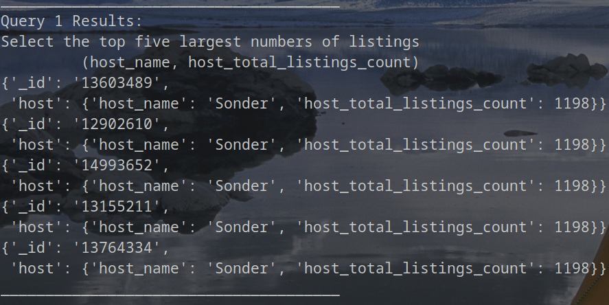
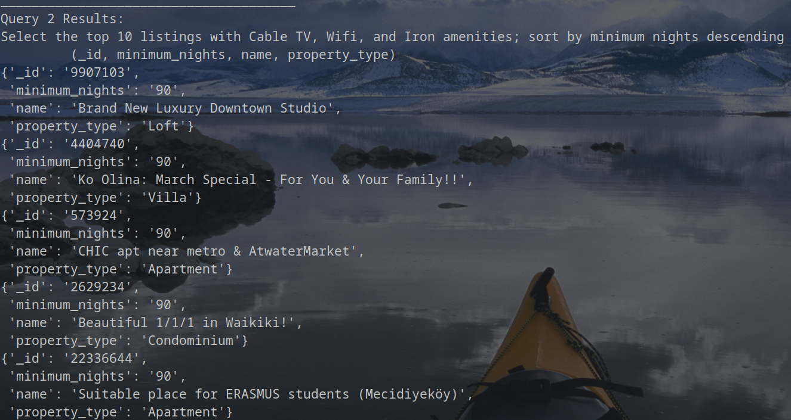
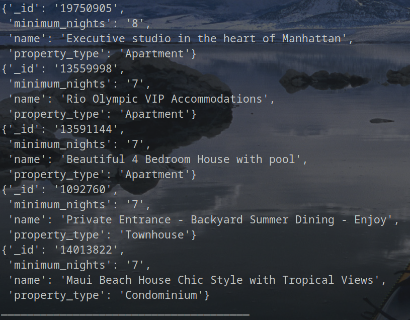
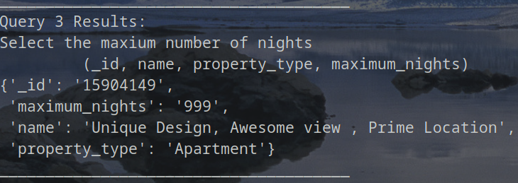
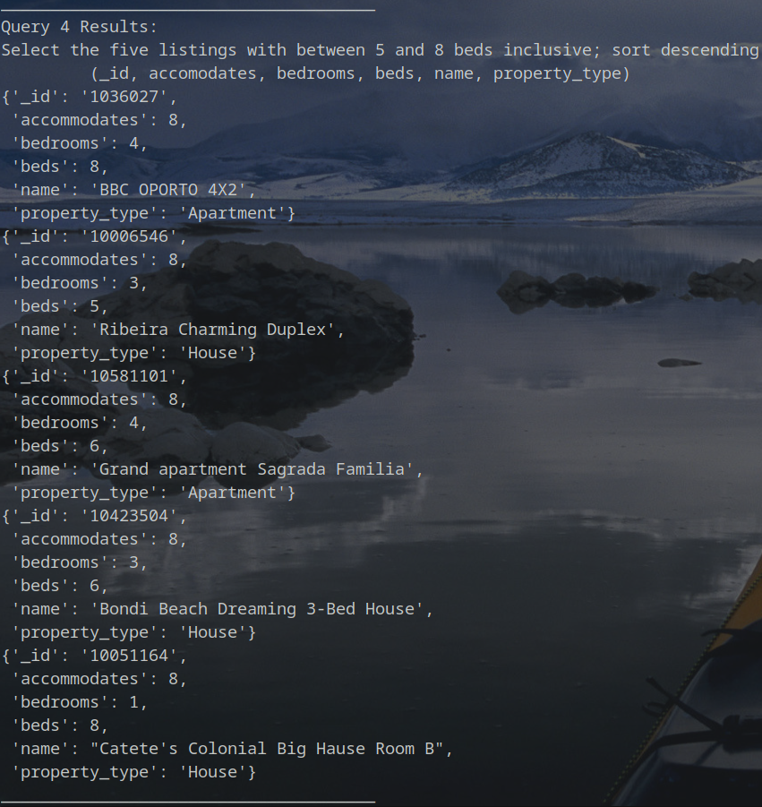
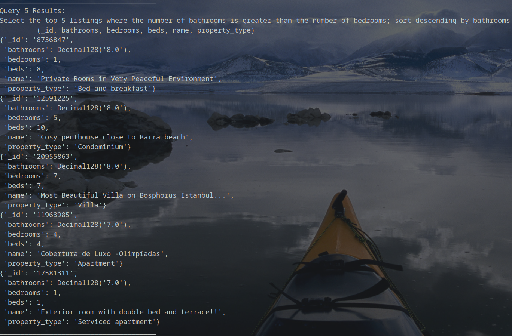
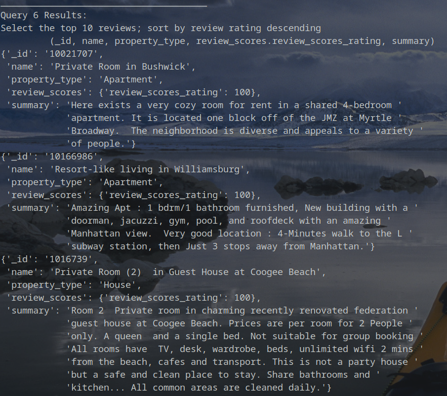
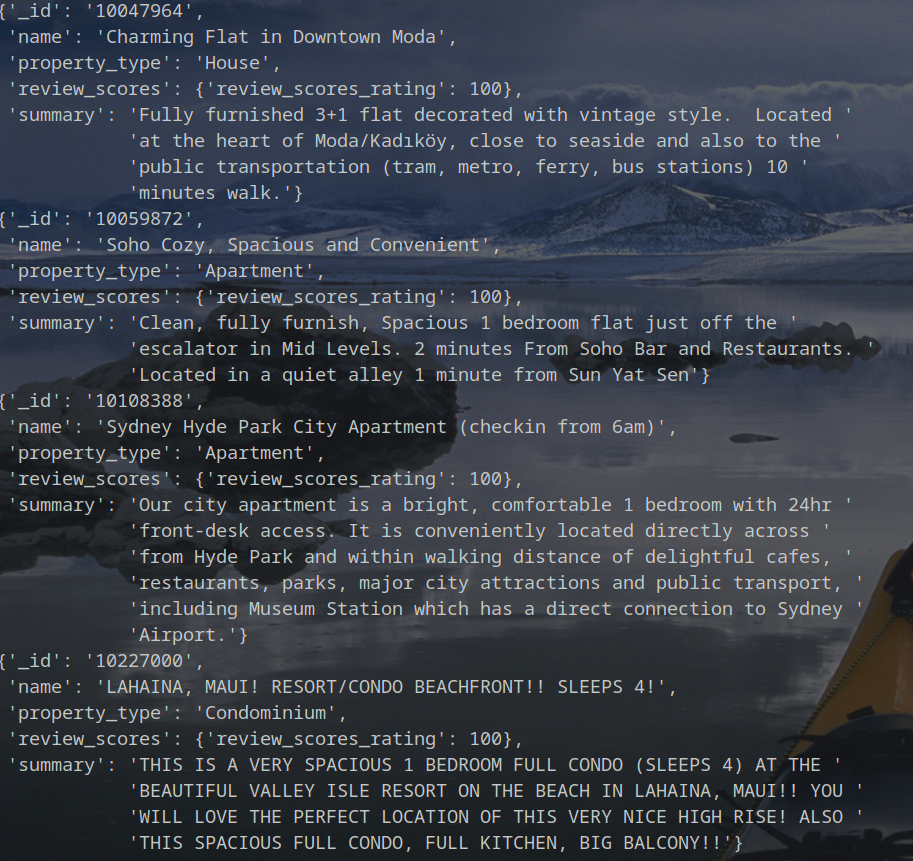
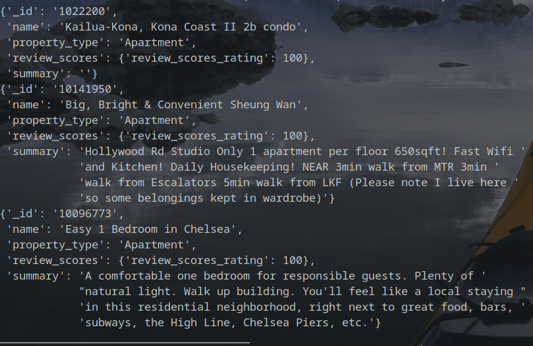

# COMP 353: Homework 2

## 2022-12-04

### Collaborators

* Anshul Narang
    * Setup the python file and loaded the airbnb sample dataset
    * Implemented all six queries based on the requirements
* Nick Shannon
    * Verified all six queries using CLI tools such as `jq` and `grep`
    * Prepared and Added screenshots of output

### MongoDB Queries

```python

# Query 1 Results:
# Select the top five largest numbers of listings; sort descending
#         (host_name, host_total_listings_count)
query=listings.find({},{
   "host.host_name": 1,
   "host.host_total_listings_count": 1
   }).sort("host.host_total_listings_count",-1).limit(5)

for quer in query:
        pprint.pprint(quer)
```



```python
# Query 2 Results:
# Select the top 10 listings with Cable TV, Wifi, and Iron amenities; 
# sort by minimum nights descending
#          (_id, minimum_nights, name, property_type)
query=listings.find(
    {
        "$and": [
            {"amenities" : "Cable TV" },
            { "amenities" :  "Wifi" },
            { "amenities" :  "Iron" }
        ]
    },
    {
       "_id": 1,
       "minimum_nights": 1,
       "name": 1,
       "property_type": 1,
    }).limit(10).sort("minimum_nights", -1)

for quer in query:
        pprint.pprint(quer)
```



```python
# Query 3 Results: 
# Select the maxium number of nights 
#          (_id, name, property_type, maximum_nights)
query=listings.find({},{
   "_id": 1,
   "name": 1,
   "property_type": 1,
   "maximum_nights": 1
   }).limit(1).sort("maximum_nights",-1)

for quer in query:
        pprint.pprint(quer)
```



```python
# Query 4 Results: 
# Select the five listings with between 5 and 
# 8 beds inclusive; sort descending 
#          (_id, accomodates, bedrooms, beds, name, property_type)
query=listings.find(
    { 
        "$and": 
    		[
                {"accommodates" : {"$gte": 5,"$lte":8}},
                {"beds": {"$gte" : 5}}
            ]
    },
    {
        "_id": 1,
        "name": 1,
        "property_type": 1,
        "accommodates": 1,
        "beds":1,
        "bedrooms":1
    }
).sort("accommodates",-1).limit(5)

for quer in query:
        pprint.pprint(quer)
```



```python
# Query 5 Results: 
# Select the top 5 listings where the number of bathrooms is greater than the number of bedrooms; sort descending by bathrooms 
#          (_id, bathrooms, bedrooms, beds, name, property_type)
query=listings.find(
    { 
        "$expr": 
            { "$gt": [ "$bathrooms" , "$bedrooms" ] } 
    },
    {
        "_id": 1,
        "name": 1,
        "property_type": 1,
        "bathrooms": 1,
        "bedrooms":1,
        "beds":1
    }).sort("bathrooms",-1).limit(5)

for quer in query:
        pprint.pprint(quer)
```



```python
# Query 6 Results: 
# Select the top 10 reviews; sort by review rating descending 
#          (_id, name, property_type, review_scores.review_scores_rating, summary)
query=listings.find({},{
       "_id": 1,
       "name": 1,
       "property_type": 1,
       "summary": 1,
       "review_scores.review_scores_rating":1
   }).sort("review_scores.review_scores_rating",-1).limit(10)

for quer in query:
        pprint.pprint(quer)

```





